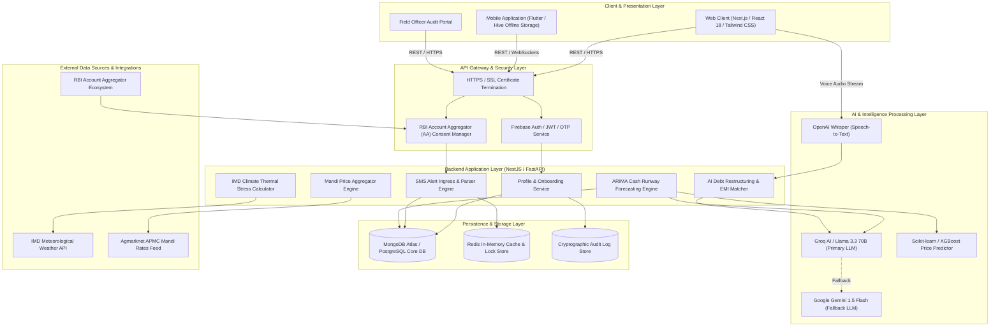

# ★ GramPulse AI — Credit Wellness & Cash Flow Intelligence Platform

> **An Enterprise-Grade AI Platform for Rural Micro-Enterprises Ingesting Passive Bank Alert Consent Data, Executing ARIMA Time-Series Risk Forecasting, Modeling IMD Thermal Yield Stress, and Generating Multilingual Debt Restructuring Advisory.**

---


---

## ★ Executive Summary & Core Motivation

In India's rural economy, over **100 million micro-entrepreneurs** — including dairy farmers, kirana store owners, poultry operators, agri-traders, and local artisans — operate on hyper-local cash flows. Despite generating steady revenue, they face critical financial vulnerability due to:

1. **Unpredictable Payout Cycles**: Co-operative milk payouts (e.g., Amul, Nandini) occur every 10–15 days, leaving severe liquidity gaps for daily fodder and inventory expenses.
2. **Climate & Extreme Weather Vulnerability**: High summer temperatures (above 35°C) cause severe thermal stress in dairy cattle, reducing milk production by **15% to 25%** without warning.
3. **Debt Trap & EMI Misalignment**: High-interest local loans or unaligned EMIs trigger sudden cash shortfalls, leading to default risks despite underlying business viability.
4. **Language & Digital Literacy Barriers**: Traditional banking apps are complex, text-heavy, and built primarily in English, alienating regional language speakers.

### System Solution

**GramPulse AI** bridges this gap by acting as an **intelligent financial co-pilot** for rural micro-enterprises. It passively ingests transaction data via bank SMS alerts and RBI Account Aggregator consent, runs **ARIMA time-series models** to forecast 30-to-90-day cash runways, simulates weather and mandi price shocks, and provides real-time debt restructuring advice in **5 regional languages** with voice companion support.

---

## ★ Detailed Architecture Flowchart



---

## ★ System Workflows & Data Pipelines

### Workflow 1: Micro-Enterprise Onboarding & RBI Consent Pipeline
```text
[Farmer / Kirana Owner] 
        │
        ▼
[1. Select Language (EN/HI/MR/GU/TE)]
        │
        ▼
[2. Phone OTP Authentication (Firebase)]
        │
        ▼
[3. Input Profile Metadata (Village, Business Sector, Cow Count)]
        │
        ▼
[4. Grant RBI Account Aggregator (AA) Passive SMS & Bank Consent]
        │
        ▼
[5. Initialize Cryptographic Data Access Audit Log & Local Cache]
```

---

### Workflow 2: Passive Transaction Ingestion & Ledger Reconciler
```text
[Bank SMS / UPI Payment Received on Device]
        │
        ▼
[Regex & NLP Parsing Engine (Extract Amount, Date, Source, Type)]
        │
        ▼
[Duplicate Transaction Detection Algorithm]
        │
        ▼
[Reconcile Cash Balance in MongoDB / PostgreSQL]
        │
        ▼
[Trigger Automatic Financial Health Score & Runway Recalculation]
```

---

### Workflow 3: ARIMA Cash Flow Forecasting & Thermal Stress Modeling
```text
[Historical 90-Day Transaction Stream + Pending EMI Liabilities]
        │
        ▼
[Execute ARIMA Time-Series Fit (Auto-ARIMA (p,d,q))]
        │
        ▼
[Fetch 7-Day Local IMD Weather Forecast (Temperature & Rainfall)]
        │
        ▼
[Apply Heat Stress Function: Yield Loss = (Temp - 34) * 4% if Temp >= 35°C]
        │
        ▼
[Generate Adjusted 30/60/90-Day Liquidity Projection Curve]
```

---

### Workflow 4: AI Debt Restructuring & Payment Matching Engine
```text
[Select Upcoming EMI Due Date (e.g. ₹7,500 Tractor EMI on July 26)]
        │
        ▼
[Calculate Forecasted Cash Balance Prior to Due Date]
        │
        ▼
[Add Incoming Expected Milk Society Payouts (e.g. ₹8,200 on July 22)]
        │
        ▼
[Compute Net Cash Safety Margin]
        │
        ├───────────────────────────┬───────────────────────────┐
        ▼                           ▼                           ▼
[Surplus >= ₹3,000]         [Surplus ₹0 - ₹3,000]        [Deficit < ₹0]
    🟢 Status: SAFE             🟡 Status: WARNING          🔴 Status: URGENT
(Prompt payment advice)    (Save ₹400/day warning)    (Refinancing / KCC restructuring)
```

---

## ★ Technology Stack

### Frontend
- **Next.js (React)** — Server-Side Rendering & Client Dashboard Framework
- **TypeScript** — End-to-End Type Safety & Interface Contracts
- **Tailwind CSS** — Utility-First Styling System & Design System
- **ShadCN UI** — Accessible & High-Performance UI Component Library

### Mobile App
- **Flutter** — Cross-Platform Mobile Application Architecture
- **Hive / SQLite** — On-Device Offline Storage & Local Caching Layer

### Backend Architecture
- **Node.js** — Asynchronous High-Throughput Server Runtime
- **NestJS** — Enterprise-Grade Scalable Modular Framework
- **REST API** — Structured API Contract & Endpoint Map

### Authentication & Access Control
- **Firebase Authentication** — Phone OTP & Federated Identity Verification
- **JWT (JSON Web Tokens)** — Stateless Secure Session Management
- **OTP Login** — Passwordless Frictionless Rural Authentication

### Database & Cloud Storage
- **PostgreSQL** — Primary Relational Data Store
- **Redis** — In-Memory High-Speed Caching & Session Storage
- **AWS S3 / Cloudinary** — Cloud Object Storage for Media & Reports

### Artificial Intelligence & Machine Learning
- **OpenAI GPT-4o / Gemini API** — Natural Language Financial Advisory
- **OpenAI Whisper** — Multilingual Speech-to-Text (`STT`) Transcription Engine
- **Google Translate API** — Dynamic Regional Language Localization
- **OpenCV + SAM** — Computer Vision & Segment Anything Model
- **Scikit-learn / XGBoost** — Commodity Price Forecasting & Demand Modeling
- **TensorFlow / LightFM** — Recommendation System for Government Schemes

### Search & Communication Infrastructure
- **Elasticsearch** — High-Performance Log & Transaction Search Index
- **Socket.IO** — Real-Time WebSockets & Live Alert Streaming

### Payments & Logistics
- **Razorpay** — Digital Merchant Payment Gateway
- **Shiprocket API** — Automated Logistics & Fulfillment Integration

### Notifications
- **Firebase Cloud Messaging (FCM)** — Push Notifications & SMS Dispatch

### Business Intelligence & Analytics
- **Chart.js** — Interactive Financial Trend Visualizations
- **Google Analytics** — User Journey Analytics & Conversion Funnels

### Cloud Infrastructure & DevOps
- **AWS (EC2, RDS, S3, CloudFront)** — Enterprise Cloud Infrastructure
- **Docker** — Containerized Microservices Ecosystem
- **GitHub Actions** — Continuous Integration & Continuous Deployment (`CI/CD`)

### Security & Compliance
- **HTTPS (SSL/TLS)** — End-to-End Encryption
- **JWT & RBAC** — Fine-Grained Role-Based Access Control
- **bcrypt** — Password Hashing Standard
- **Helmet.js** — HTTP Security Headers Hardening

---

## ★ Core Features & Capabilities

| Module | Purpose | Technical Implementation |
|:---|:---|:---|
| **Main Enterprise Dashboard** | Comprehensive financial overview displaying Health Score, Cash Runway, DTI Ratio, and active advisories. | Real-time status indicators (`SAFE`, `WARNING`, `CRITICAL`). |
| **Cash Flow Forecast & Simulator** | Interactive 30-day projection curve with stress-testing scenario sliders. | Dynamic simulation of milk fat drops, feed inflation, and weather delays. |
| **ARIMA Risk Analysis** | Decomposes financial health into 4 core risk drivers with automated AI diagnosis. | Combines ARIMA statistical models with LLM root-cause analysis. |
| **AI Debt Repayment Advisory** | Matches projected cash flow against upcoming EMI due dates to calculate net cash safety. | Cash-flow matching algorithm with debt prioritization queue. |
| **Mandi Price Intelligence** | Live APMC market commodity rates (Milk, Wheat, Cotton, Rice, Vegetables). | Price trend indicators (Upward, Downward, Stable) and inter-mandi comparison tables. |
| **IMD Climate & Weather Portal** | 7-day temperature & rainfall forecast with cattle thermal stress yield loss calculator. | Calculates specific daily litres output loss for dairy livestock. |
| **Transaction Passbook & Ingress** | Digital ledger auto-parsed from bank SMS and UPI payment notifications. | Zero-friction transaction entry with duplicate detection. |
| **Government Scheme Matcher** | AI-curated eligibility checker for PM Mudra, PM-KISAN, AHIDF, and CGTMSE. | Automated eligibility scoring & application guides. |
| **GramBot AI Voice Companion** | Interactive assistant with Speech-to-Text (`STT`) and Text-to-Speech (`TTS`) in regional dialects. | Driven by OpenAI GPT-4o / Gemini API with offline fallback. |
| **RBI Consent & Privacy Controls** | Complete control over RBI Account Aggregator (AA) data permission sync. | Granular consent toggles and cryptographic audit access logs. |

---

## ★ Regional Language Support

GramPulse AI supports **5 major Indian languages**:
- **English** (`en`)
- **Hindi / हिन्दी** (`hi`)
- **Marathi / मराठी** (`mr`)
- **Gujarati / ગુજરાતી** (`gu`)
- **Telugu / తెలుగు** (`te`)

---

## ★ Mathematical Models & Analytical Logic

### 1. Financial Health Score Index
$$\text{Health Score} = 100 - (30 - \text{Runway Days}) \times 2 - (\text{DTI Ratio} - 40) \times 0.5$$

- **Range**: $0 \text{ to } 100$
- **Classification**:
  - `GREEN (Healthy)`: $\text{Score} \ge 85$
  - `YELLOW (Warning)`: $70 \le \text{Score} < 85$
  - `RED (Critical Risk)`: $\text{Score} < 70$

---

### 2. Cash Runway Prediction Model
$$\text{Cash Runway Days} = \max\left(5, \frac{\text{Current Liquid Cash Balance}}{\text{Daily Net Burn Rate}}\right)$$

---

### 3. Debt-to-Income (DTI) Ratio Calculation
$$\text{DTI \%} = \left(\frac{\text{Total Monthly Loan EMIs}}{\text{Estimated Monthly Income}}\right) \times 100$$

- **Safe Zone**: $\text{DTI} \le 30\%$
- **Moderate Burden**: $30\% < \text{DTI} \le 50\%$
- **High Risk**: $\text{DTI} > 50\%$

---

### 4. IMD Thermal Stress Yield Loss Function
$$\text{Yield Loss \%} = \begin{cases} 0\% & \text{if Temperature } < 35^\circ\text{C} \\ (\text{Temperature} - 34) \times 4\% & \text{if Temperature } \ge 35^\circ\text{C} \end{cases}$$

---

## ★ Future Roadmap & Innovations

- **Blockchain Integration (Hyperledger Fabric / Polygon)** — Immutable cryptographic ledger for credit identity verification & peer-to-peer micro-lending.
- **QR Code & NFC Integration** — Instant offline payment verification & receipt digitization at local APMC mandis.

---

## ★ Local Environment & Setup Guide

### Prerequisites
- **Node.js**: `v18.0.0` or higher
- **Python**: `v3.10` or higher
- **Git**: Installed

---

### 1. Clone Repository
```bash
git clone https://github.com/HardikMathur11/GramPulse-AI.git
cd GramPulse-AI
```

---

### 2. Backend Setup
```bash
cd backend
python -m venv venv
# Windows:
venv\Scripts\activate
# macOS/Linux:
source venv/bin/activate

pip install -r requirements.txt
uvicorn main:app --port 8000 --reload
```

---

### 3. Frontend Setup
```bash
cd frontend
npm install
npm run dev
```

---

## ★ License

This project is licensed under the **Apache 2.0 License**.

---

<p align="center">
  <b>GramPulse AI</b> — Financial Intelligence & Credit Wellness Platform
</p>
